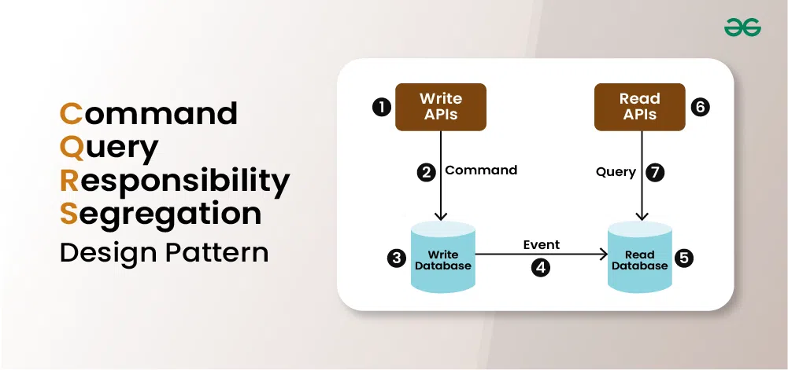

# CQRS (Command Query Responsibility Segregation)



## Vue d'ensemble

CQRS est un pattern architectural qui sépare les opérations de lecture (Queries) des opérations d'écriture (Commands) dans une application.
Cette séparation permet d'optimiser les performances, la scalabilité et la sécurité des applications en traitant les deux types d'opérations de manière distincte.

## Principes fondamentaux

### 1. Séparation Commands/Queries

- **Commands**: Modifient l'état du système
  - Pas de retour de données
  - Validation métier
  - Modification de l'état

- **Queries**: Lecture des données
  - Pas de modification d'état
  - Optimisées pour la lecture
  - Retournent des DTOs

### 2. Modèles de données séparés

- **Write Model**: 
  - Orienté domaine
  - Garantit la cohérence
  - Contient la logique métier

- **Read Model**:
  - Dénormalisé
  - Optimisé pour les requêtes
  - Pas de logique métier

## Avantages

- Meilleure scalabilité
- Séparation des responsabilités
- Performance optimisée
- Flexibilité accrue

## Considérations

- Complexité accrue
- Cohérence éventuelle
- Surcharge de maintenance

## Cas d'utilisation

- Applications à fort trafic de lecture
- Systèmes complexes
- Besoins de scalabilité différents pour lecture/écriture

## Implémentation type

```csharp
// Exemple de Command
public class CreateOrderCommand : ICommand
{
    public Guid OrderId { get; set; }
    public string CustomerName { get; set; }
}

// Exemple de Query
public class GetOrderQuery : IQuery<OrderDto>
{
    public Guid OrderId { get; set; }
}
```
